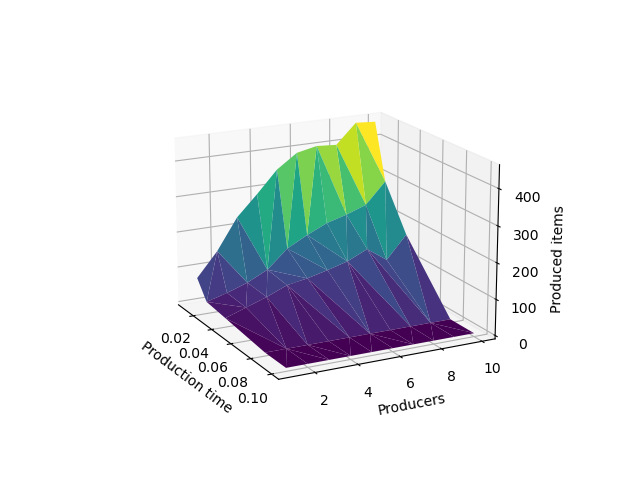
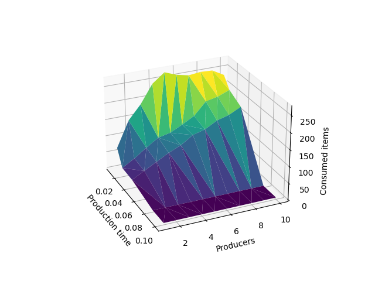

# Assignment 03

More information about assignment at [3. excercise – Switch, P-C, R-W 💡](https://uim.fei.stuba.sk/i-ppds/3-cvicenie-fibonacci-vypinac-p-k-c-z-%f0%9f%92%a1/?%2F).

# About

This assignment consist of 3 exercises.
We did 2 documented exercises.

- The 1st exercise with ADT LightSwitch is in [e1.py](e1.py).
- The 2nd exercise with Producer-consumer synchronization problem [e2.py](e2.py).

## Exercise 1

We implemented ADT LightSwitch according to the specification from the lecture.

## Exercise 2

We implemented the solution to the Consumer-Producer problem. And we experimented with different system settings.

- Product production time - changed on scale [0.01, 0.02, 0.04, 0.08, 0.1]
- Product processing time - constant at 0.04
- number of consumers - constant at 10
- number of producers - variable in range (1,11)
- size of storage room - 10

We tryed to find out what parameters are optimal for this system settings and we will discuss it under the graph images.

# Question

- Number of products produced per unit time

  

  > On this chart, you can see three axes. Axis of dependence of production time, number of producers and things they produced. As you can see, the correlation is visible with a small anomaly at 8 producers, when the production did not increase so significantly compared to the setup with 7 producers. But more or less..., the more producers in a shorter production time, the more products they produce.

  

  > On this chart, you can see three axes. The axis of dependence of production time, number of producers and things that consumers have processed. Here it is not so clear, because we can see, that the best setting we got, was when the number of producers was 5. But only when producers can produce in the shortest time we measured. So it's very questionable which setup would realistically be the best. But based on this experiment, I evaluate this as best

# Evaluation

I will come back to this excercise and i will try much more experiments with improved grid search for finding the best settings possible.
