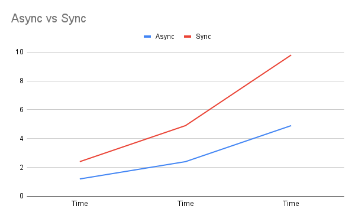

# Assignment 08

More information about assignment at [8. excercise – Asynchronous programming](https://uim.fei.stuba.sk/i-ppds/8-cvicenie-asynchronne-programovanie/).

# About

This assignment consist of 4 exercises. We did code them according to lecture expect 1 we invented ourselves.

- Synchronous Factorial calculator [e3.py](e3.py).
- Asynchronous Factorial calculator [e3_async.py](e3_async.py).

# Description

We wrote our own single-threaded application in two versions: synchronous and asynchronous (using native coroutines). We wrote simple application to demostrate the performance comparison of synchronous and asynchronous versions. The goal of the application is to calculate the factorial of the given number.
We have set the values so that the experimentation makes sense in statistic manner, and so that we can compare these 2 kinds of programming approaches.

---
## Experiment 

We set multiple tasks for each values and doubled the values for each run. We did run the program multiple times with diffrent configuration settings to have enough data to evaluate the results.

 ---

### Double the value for each task with #1

| Task count  |  Task 1 |  Task 2 | Task 3 | Task 4 | Task 5  | Async | Sync  |
|---|---|---|---|---|---|---|---|
|  2 | 5  | 10  | -  | -  | -  | 0.1s  | 0.2s  |
|  3 | 5 | 10  | 20  | -  | -  | 0.3s | 0.6s  |
|  4 | 5  | 10  | 20  | 40  | -  | 0.6s  | 1.2s  |
|  5 | 5  | 10  | 20  | 40  | 80  | 1.2s  | 2.4s  |

 

 ---

### Double the value for each task with #2

| Task count  |  Task 1 |  Task 2 | Task 3 | Task 4 | Task 5  | Async | Sync  |
|---|---|---|---|---|---|---|---|
|  2 | 10  | 20  | -  | -  | -  | 0.3s  | 0.5s |
|  3 | 10 | 20  | 40  | -  | -  | 0.6s   | 1.1s |
|  4 | 10  | 20  | 40  | 80  | -  | 1.2s  | 2.3s  |
|  5 | 10  | 20  | 40  | 80  | 160  | 2.4s  | 4.9s  |

 

 ---

### Double the value for each task with #3

| Task count  |  Task 1 |  Task 2 | Task 3 | Task 4 | Task 5  | Async | Sync  |
|---|---|---|---|---|---|---|---|
|  2 | 20  | 40  | -  | -  | -  | 0.6s  | 0.9s  |
|  3 | 20  | 40  | 80  | -  | -  | 1.2s | 2.2s  |
|  4 | 20  | 40  | 80  | 160  | -  | 2.5s  | 4.7s  |
|  5 | 20  | 40  | 80  | 160  | 320  | 4.9s  | 9.8s  |

 

  ---

### Double the value for each task with 2 tasks

|  Task 1 |  Task 2 | Async | Sync |   
|---|---|---|---|
| 5  | 10  | 0.1s  | 0.2s  |
| 10  | 20  |  0.3s | 0.5s  |
| 20  | 40  |  0.6  | 0.9s  |

 

 ---

### Double the value for each task with 5 tasks

|  Task 1 |  Task 2 | Task 3 | Task 4 | Task 5  | Async | Sync  |
|---|---|---|---|---|---|---|
| 5  | 10  | 20  | 40  | 80  | 1.2s  | 2.4s  |
| 10  | 20  | 40  | 80  | 160  | 2.4s  | 4.9s  |
| 20  | 40  | 80  | 160  | 320  | 4.9s  | 9.8s  |

 
 
 ---

 ## Evaluation

 From the evaluated data and graphs we noticed that the computation time of the synchronous program grows much faster. So we decided to give the program way bigger numbers to calculate factorial. We have set numbers for each task down below.

        tasks = [
        make_fact('Five', 300),
        make_fact('One', 200),
        make_fact('Two', 400),
        make_fact('Three', 500),
        make_fact('Four', 100),
    ]

With this configuration the computing time for synchronous program was 23.4 seconds while asynchronous did it in 7.8 seconds, wich is 3 times less then synchronous program.
We also run the experiment with added tasks and for synchronous program was 43.5 seconds while asynchronous did it in 7.9 seconds, wich is 5.5 times less then synchronous program.

        make_fact('Five', 300),
        make_fact('One', 200),
        make_fact('Two', 400),
        make_fact('Three', 500),
        make_fact('Four', 100),
        make_fact('Five', 200),
        make_fact('Six', 400),
        make_fact('Seven', 500),
        make_fact('Eight', 100),

According to timing results it can be seen, that the asynchronous implementation is faster than the synchronous one.
In a synchronous implementation, the individual tasks are executed one after the other, in an asynchronous implementation the tasks can execute competitively since there is no blocking of the program execution, but only of the individual tasks, which means that if one task is blocked the others can continue. So we can say that the asynchronous programming is cool. 😎

